# {: style="height:1.5em"} Alignment

This section describes the alignment steps in the Poppy pipeline. It takes the trimmed and merged FASTQ files produced by the [pre‑alignment](prealignment.md) module and produces a single, sorted, duplicate‑marked BAM file per sample that is used by downstream modules (SNV/indel calling, CNV/SV detection, and QC).

All alignment rules are provided by the [Hydra‑Genetics alignment module](https://github.com/hydra-genetics/alignment) (v0.5.1).

---

## Input Files

The alignment module takes the trimmed and merged FASTQ files produced by the [pre‑alignment](prealignment.md) module as input.

| Input File                                            | Source                                  |
| ----------------------------------------------------- | --------------------------------------- |
| `prealignment/merged/{sample}_{type}_fastq1.fastq.gz` | [Pre‑alignment module](prealignment.md) |
| `prealignment/merged/{sample}_{type}_fastq2.fastq.gz` | [Pre‑alignment module](prealignment.md) |

---

## Workflow Steps

### 1. BWA‑MEM — Read Alignment

Each FASTQ pair (one per flowcell / lane / barcode) is aligned to the reference genome using [BWA‑MEM](http://bio-bwa.sourceforge.net/).

| Item      | Value                                                               |
| --------- | ------------------------------------------------------------------- |
| Container | `hydragenetics/bwa_mem:0.7.17`                                      |
| Input     | `prealignment/merged/{sample}_{type}_{read}.fastq.gz`               |
| Output    | `alignment/bwa_mem/{sample}_{type}_{flowcell}_{lane}_{barcode}.bam` |

### 2. Samtools Merge (per‑lane) — Merge Lane BAMs

When a sample has been sequenced across multiple flowcells or lanes, the per‑lane BAM files are merged into a single unsorted BAM with `samtools merge`.

| Item   | Value                                                   |
| ------ | ------------------------------------------------------- |
| Output | `alignment/bwa_mem/{sample}_{type}.bam` (after sorting) |

### 3. Samtools Extract Reads — Split by Chromosome

The merged BAM is split into per‑chromosome BAM files. This allows duplicate marking to run in parallel for each chromosome, significantly reducing wall‑clock time.

| Item   | Value                                                        |
| ------ | ------------------------------------------------------------ |
| Output | `alignment/samtools_extract_reads/{sample}_{type}_{chr}.bam` |

### 4. Picard MarkDuplicates — Duplicate Marking

Duplicate reads are flagged independently per chromosome using [Picard MarkDuplicates](https://broadinstitute.github.io/picard/command-line-overview.html#MarkDuplicates).

| Item      | Value                                                        |
| --------- | ------------------------------------------------------------ |
| Container | `hydragenetics/picard:2.25.0`                                |
| Output    | `alignment/picard_mark_duplicates/{sample}_{type}_{chr}.bam` |

### 5. Samtools Merge — Combine Chromosomes

The per‑chromosome, duplicate‑marked BAM files are merged back into a single BAM.

| Item   | Value                                                              |
| ------ | ------------------------------------------------------------------ |
| Output | `alignment/samtools_merge_bam/{sample}_{type}.bam` (after sorting) |

### 6. Samtools Index — BAM Indexing

The final merged BAM is indexed so that it can be efficiently queried by downstream tools.

| Item   | Value                                                  |
| ------ | ------------------------------------------------------ |
| Output | `alignment/samtools_merge_bam/{sample}_{type}.bam.bai` |

---

## DAG

The diagram below shows the rule dependencies within the alignment module:

{: .responsive-diagram}

---

## Key Output Files

| Output File                                            | Description                          |
| ------------------------------------------------------ | ------------------------------------ |
| `alignment/samtools_merge_bam/{sample}_{type}.bam`     | Merged, sorted, duplicate‑marked BAM |
| `alignment/samtools_merge_bam/{sample}_{type}.bam.bai` | BAM index                            |

---

## Downstream Consumers

The final BAM and its index are copied into the `results/bam/` output directory as final pipeline outputs:

- **`bam/{sample}_{type}.bam`** — Final merged BAM
- **`bam/{sample}_{type}.bam.bai`** — BAM index

They are also used by multiple downstream modules:

- **[SNV / Indels](snvs.md)** — GATK Mutect2, VarDict
- **[CNV / SV](cnvs.md)** — CNVkit, GATK CNV, Pindel
- **[QC](qc.md)** — Mosdepth, Picard CollectHsMetrics, samtools stats, and others

---

## Configuration

The relevant sections in `config.yaml`:

```yaml
bwa_mem:
  amb: "/path/to/reference.amb"
  ann: "/path/to/reference.ann"
  bwt: "/path/to/reference.bwt"
  pac: "/path/to/reference.pac"
  sa: "/path/to/reference.sa"
  container: "docker://hydragenetics/bwa_mem:0.7.17"

picard_mark_duplicates:
  container: "docker://hydragenetics/picard:2.25.0"
```

See the full [config.yaml](https://github.com/genomic-medicine-sweden/poppy) for all available settings.
