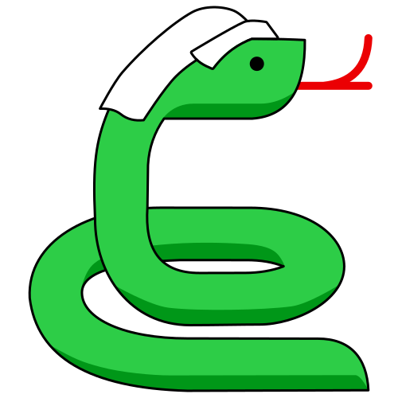

# {: style="height:1.5em"} Copy Number Variants (CNVs) and Structural Variants (SVs)

This section describes the CNV and SV detection steps in the Poppy pipeline, as well as the generation of the final CNV HTML report. It takes the merged, sorted, and duplicate‑marked BAM files produced by the [alignment](alignment.md) module, along with variant calls from the SNV/indel module, and produces fully annotated and filtered candidate CNV/SVs and a comprehensive HTML report.

The core rules are provided by the [Hydra‑Genetics cnv_sv](https://github.com/hydra-genetics/cnv_sv) and [reports](https://github.com/hydra-genetics/reports) modules. In addition, Poppy implements several local adaptations (via `workflow/rules/pindel_processing.smk` and `workflow/rules/svdb.smk`) to modify formatting, annotations, and merge behaviors specifically for the myeloid workflow.

{: .responsive-diagram}

---

## Input Files

| Input File                                                                                                          | Source                           |
| ------------------------------------------------------------------------------------------------------------------- | -------------------------------- |
| `alignment/samtools_merge_bam/{sample}_{type}.bam`                                                                  | [Alignment module](alignment.md) |
| `snv_indels/bcbio_variation_recall_ensemble/{sample}_{type}.ensembled.vep_annotated.filter.germline.vcf.gz`         | [SNV / Indels module](snvs.md)   |
| `snv_indels/gatk_mutect2/{sample}_{type}.normalized.sorted.vep_annotated.filter.germline.bcftools_annotated.vcf.gz` | [SNV / Indels module](snvs.md)   |

---

## Workflow Steps

### 1. CNVkit — Copy Number Segmentation

Calculates copy number segmentation from targeted sequencing read depths using [CNVkit](https://cnvkit.readthedocs.io/).

| Item      | Value                                                                                                       |
| --------- | ----------------------------------------------------------------------------------------------------------- |
| Container | `hydragenetics/cnvkit:0.9.11`                                                                                |
| Input     | `alignment/samtools_merge_bam/{sample}_{type}.bam`                                                          |
| Input     | `snv_indels/bcbio_variation_recall_ensemble/{sample}_{type}.ensembled.vep_annotated.filter.germline.vcf.gz` |
| Output    | `cnv_sv/cnvkit_batch/{sample}/{sample}_{type}.cns`                                                          |

### 2. GATK CNV — Copy Number Segmentation

Utilizes GATK tools (`CollectReadCounts`, `DenoiseReadCounts`, and `ModelSegments`) to produce copy number ratio segments.

| Item      | Value                                               |
| --------- | --------------------------------------------------- |
| Container | `hydragenetics/gatk4:4.1.9.0`                       |
| Input     | `alignment/samtools_merge_bam/{sample}_{type}.bam`  |
| Output    | `cnv_sv/gatk_model_segments/{sample}_{type}.cr.seg` |

### 3. PureCN — Tumor Purity & Ploidy Estimation

Estimates tumor purity and ploidy, and integrates read depth with B-allele frequencies from the SNV/indel module VCF using [PureCN](https://bioconductor.org/packages/PureCN/).

| Item      | Value                                                                                                               |
| --------- | ------------------------------------------------------------------------------------------------------------------- |
| Container | `hydragenetics/purecn:2.2.0`                                                                                        |
| Input     | `alignment/samtools_merge_bam/{sample}_{type}.bam`                                                                  |
| Input     | `snv_indels/gatk_mutect2/{sample}_{type}.normalized.sorted.vep_annotated.filter.germline.bcftools_annotated.vcf.gz` |
| Output    | Used internally for tumor content reporting and dynamic report rendering.                                           |

### 4. Pindel — Structural Variant Calling

Detects long insertions, deletions, and structural variants for a specific targeted set of myeloid genes using [Pindel](https://github.com/genome/pindel).

| Item      | Value                                                       |
| --------- | ----------------------------------------------------------- |
| Container | `hydragenetics/pindel:0.2.5b9`                              |
| Input     | `alignment/samtools_merge_bam/{sample}_{type}.bam`          |
| Output    | `cnv_sv/pindel_vcf/{sample}_{type}.no_tc.normalized.vcf.gz` |

### 5. Pindel Processing (Local Adaptation)

Because Pindel outputs an older version of VCF, it requires specific formatting adjustments for downstream reporting. Local rules (`workflow/rules/pindel_processing.smk`) are executed to:

- **Fix AF**: Adds allele frequency (AF) and depth (DP) to the INFO field.
- **VEP Annotation**: Annotates the normalized Pindel VCF using VEP.
- **Artifact Annotation**: Tags known artifacts based on a custom reference panel.
- **CSQ Correction**: Adds missing CSQ annotation from VEP if necessary.

| Item   | Value                                                                                        |
| ------ | -------------------------------------------------------------------------------------------- |
| Output | `cnv_sv/pindel_vcf/{sample}_{type}.no_tc.normalized.vep_annotated.artifact_annotated.vcf.gz` |

### 6. SVDB Merge — Caller Combination

The structural variant calls from CNVkit and GATK CNV are aggregated into a single set. Poppy uses a local rule (`svdb_merge_wo_priority`) to merge VCF files from the different CNV callers _without_ prioritizing one caller over the other.

| Item      | Value                                                      |
| --------- | ---------------------------------------------------------- |
| Container | `hydragenetics/svdb:2.6.0`                                 |
| Output    | `cnv_sv/svdb_merge/{sample}_{type}.{tc_method}.merged.vcf` |

### 7. SVDB Query — Database Annotation

The merged VCF is queried and annotated against structural variant databases (SVDB).

| Item      | Value                                                             |
| --------- | ----------------------------------------------------------------- |
| Container | `hydragenetics/svdb:2.6.0`                                        |
| Output    | `cnv_sv/svdb_query/{sample}_{type}.{tc_method}.svdb_query.vcf.gz` |

### 8. Annotation and Hard Filtering

The SVDB merged outputs are further annotated with relevant CNV gene sets and are hard-filtered based on predefined criteria to isolate high-confidence calls for clinical reporting. The criteria are defined in `config_hard_filter_cnv.yaml`:

| Filter                 | Criterion                                 | Description                                                       |
| ---------------------- | ----------------------------------------- | ----------------------------------------------------------------- |
| \`copy_number_normal\` | \`INFO:SVTYPE = COPY_NORMAL\`             | Hard filter CNVs with COPY_NORMAL                                 |
| \`artifacts\`          | \`(INFO:Normal_AF > 0.15)\`               | Hard filter variants found in more than 15% of the normal samples |
| \`amp_gene\`           | \`(!exist[[A-Za-z0-9_,-]+, INFO:Genes])\` | Only keep variants with gene annotations                          |

| Item   | Value                                                                                                           |
| ------ | --------------------------------------------------------------------------------------------------------------- |
| Output | `cnv_sv/svdb_query/{sample}_{type}.{tc_method}.svdb_query.annotate_cnv.cnv_genes.filter.cnv_hard_filter.vcf.gz` |

### 9. HTML Reporting Module

The filtered CNV/SV results, along with purity and ploidy estimates, are combined by the reporting module to generate a stand-alone CNV HTML report. Results are formatted dynamically depending on the selected tumor content estimation method (e.g., `pathology` vs. `purecn`).

| Item   | Value                                                               |
| ------ | ------------------------------------------------------------------- |
| Output | `reports/cnv_html_report/{sample}_{type}.pathology.cnv_report.html` |
| Output | `reports/cnv_html_report/{sample}_{type}.purecn.cnv_report.html`    |

---

## Key Output Files

| Output File                                                     | Description                                    |
| --------------------------------------------------------------- | ---------------------------------------------- |
| `vcf/{sample}_{type}.pindel.vep_annotated.filter.pindel.vcf.gz` | Final annotated and filtered Pindel VCF output |
| `cnv/{sample}/{sample}_{type}.pathology.svdb_query.vcf.gz`      | SVDB merged CNV VCF                            |
| `cnv/{sample}/{sample}_{type}.pathology.cnv_report.html`        | CNV HTML dynamic report (pathology TC)         |
| `cnv/{sample}/{sample}_{type}.purecn.cnv_report.html`           | CNV HTML dynamic report (PureCN TC)            |

---

## Downstream Consumers

The outputs generated by the CNV callers and the HTML report module are the endpoints of the pipeline. They are delivered to clinical geneticists and researchers via the final output repository structure (i.e. to `vcf/` and `cnv/` folders).

---

## Configuration

The relevant sections governing CNV calling, SVDB merging, Pindel processing, and HTML reports in the configuration files (`config_static.yaml` and `config_custom.yaml`) include:

```yaml
# ── config_static.yaml (static tool settings) ────────────────────────────────
annotate_cnv:
  cnv_genes: "{{POPPY_HOME}}/config/cnv_genes.hg19.bed"

cnv_html_report:
  cytobands: false
  show_table: true

cnvkit_batch:
  container: "docker://hydragenetics/cnvkit:0.9.11"
  normal_reference: "{{REFERENCE_DIRECTORY}}/reference_files/cnvkit.PoN.cnn"
  method: hybrid

cnvkit_call:
  container: "docker://hydragenetics/cnvkit:0.9.11"

cnvkit_vcf:
  container: "docker://hydragenetics/cnvkit:0.9.11"
  hom_del_limit: 0.47
  het_del_limit: 1.68
  dup_limit: 2.3

filter_vcf:
  germline: "{{POPPY_HOME}}/config/filters/config_hard_filter_germline.yaml"
  pindel: "{{POPPY_HOME}}/config/filters/config_soft_filter_pindel.yaml"
  cnv_hard_filter: "{{POPPY_HOME}}/config/filters/config_hard_filter_cnv.yaml"

gatk_collect_allelic_counts:
  container: "docker://hydragenetics/gatk4:4.1.9.0"

gatk_collect_read_counts:
  container: "docker://hydragenetics/gatk4:4.1.9.0"

gatk_denoise_read_counts:
  container: "docker://hydragenetics/gatk4:4.1.9.0"
  normal_reference: "{{REFERENCE_DIRECTORY}}/reference_files/gatk.PoN.hdf5"

gatk_model_segments:
  container: "docker://hydragenetics/gatk4:4.1.9.0"

merge_cnv_json:
  annotations:
    - "{{POPPY_HOME}}/config/cnv_genes.hg19.bed"
  germline_vcf: snv_indels/bcbio_variation_recall_ensemble/{sample}_{type}.ensembled.vep_annotated.filter.germline.vcf.gz
  filtered_cnv_vcfs:
    - cnv_sv/svdb_query/{sample}_{type}.{tc_method}.svdb_query.annotate_cnv.cnv_genes.filter.cnv_hard_filter.vcf.gz
  unfiltered_cnv_vcfs:
    - cnv_sv/svdb_query/{sample}_{type}.{tc_method}.svdb_query.annotate_cnv.cnv_genes.vcf.gz

pindel2vcf:
  container: "docker://hydragenetics/pindel:0.2.5b9"
  extra: "-e 10 -mc 10 -is 5 -he 0.01 -G"

pindel_update_vcf:
  container: "docker://hydragenetics/picard:2.25.4"

purecn:
  container: docker://hydragenetics/purecn:2.2.0
  genome: hg19
  interval_padding: 100
  segmentation_method: internal
  fun_segmentation: PSCBS
  normaldb: "{{REFERENCE_DIRECTORY}}/reference_files/purecn_normal_db.rds"
  intervals: "{{REFERENCE_DIRECTORY}}/reference_files/purecn_targets_intervals.txt"
  mapping_bias_file: "{{REFERENCE_DIRECTORY}}/reference_files/purecn_mapping_bias.rds"
  extra: "--model betabin --post-optimize"

purecn_coverage:
  container: docker://hydragenetics/purecn:2.2.0
  intervals: "{{REFERENCE_DIRECTORY}}/reference_files/purecn_targets_intervals.txt"

svdb_merge:
  container: docker://hydragenetics/svdb:2.6.0
  tc_method:
    - name: purecn
      cnv_caller:
        - cnvkit
        - gatk
    - name: pathology
      cnv_caller:
        - cnvkit
        - gatk

svdb_query:
  container: docker://hydragenetics/svdb:2.6.0
  db_string: "--db {{REFERENCE_DIRECTORY}}/reference_files/svdb_cnv.vcf --out_frq Normal_AF --out_occ Normal_OCC"

# pindel_call contains both static settings and a custom path:
pindel_call:
  # Defined in config_static.yaml (static tool settings):
  container: "docker://hydragenetics/pindel:0.2.5b9"
  extra: "-x 2 -B 60"
  # Defined in config_custom.yaml (user paths):
  include_bed: "/path/to/your/pindel_regions.bed"

# ── config_custom.yaml (user paths) ──────────────────────────────────────────
gatk_collect_allelic_counts:
  SNP_interval: "/path/to/gnomad_SNP_interval.interval_list"

merge_cnv_json:
  ref_genes: "/path/to/refGene.txt"

pindel2vcf:
  refname: "hg19"   # or GRCh38 — the reference genome name used in the VCF header
  refdate: "2009"   # date of the reference genome

purecn:
  genome: hg19  # or GRCh38 — overrides the static default if needed
```

See the full configuration files (`config_static.yaml`, `config_custom.yaml`, and `config/filters/*.yaml`) for comprehensive configurations, including references to the filters applied.

---
