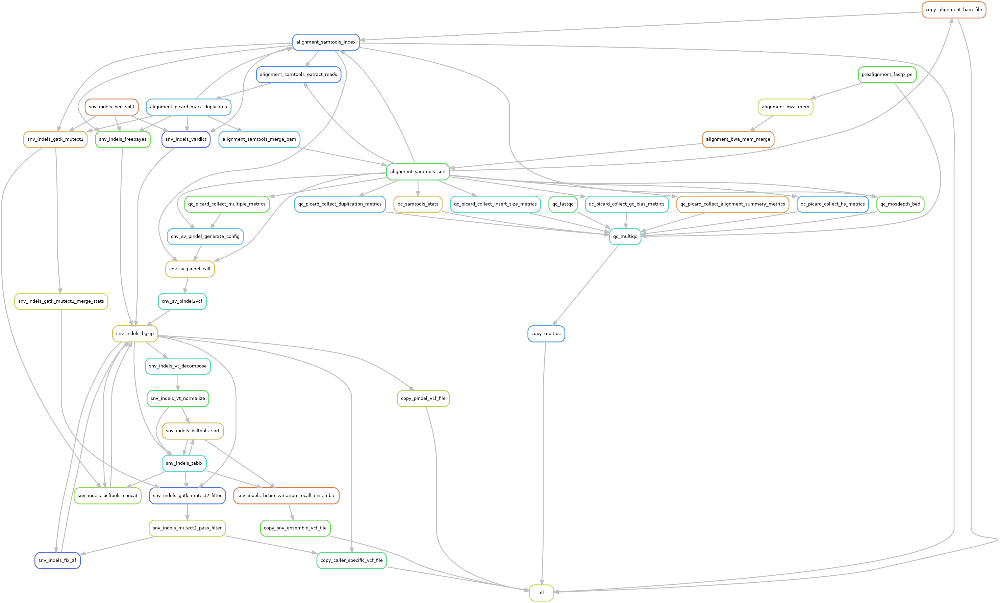

# Introduction

[Poppy](https://github.com/genomic-medicine-sweden/Twist_DNA_Hematology) is a Snakemake pipeline used for analyzing hybrid capture short-read sequencing data from the [Genomic Medicine Sweden](https://genomicmedicine.se/en/)  (GMS) myeloid gene panels. It uses the [Hydra-Genetics](https://github.com/hydra-genetics) framework.

{: style="height:90%;width:90%"} 
