{: style="height:45%;width:45%"}

# Poppy Pipeline Overview

Poppy uses [Hydra-Genetics](https://hydra-genetics.readthedocs.io/en/latest/) modules to analyse hybrid capture short-read sequencing data from the [Genomic Medicine Sweden](https://genomicmedicine.se/en/) myeloid gene panels.

{: .responsive-diagram-large}

## Hydra-Genetics Module Versions

| Module         | Version |
| -------------- | ------- |
| alignment      | v0.5.1  |
| annotation     | v1.0.0  |
| cnv_sv         | 1aa9a68 |
| filtering      | v0.3.0  |
| prealignment   | v1.2.0  |
| reports        | v0.3.1  |
| snv_indels_gms | v0.6.0  |
| qc             | v0.4.1  |

---

## Alignment

**Description:** Align reads to the reference genome using BWA‑MEM (Docker image `hydragenetics/bwa_mem:0.7.17`) and marks duplicates using Picard's MarkDuplicates (Docker image `hydragenetics/picard:2.25.0`).
**Key Outputs**

| Output File                                        | Description                          |
| -------------------------------------------------- | ------------------------------------ |
| `alignment/samtools_merge_bam/{sample}_{type}.bam` | Merged, sorted, duplicate marked BAM |
| `alignment/bam_index/{sample}_{type}.bam.bai`      | BAM index                            |

---

## Annotation

**Description:** Annotate VCF files with VEP (Docker image `hydragenetics/vep:111.0`) and/or custom annotations such as artifact and background annotation from the reference pipeline.
**Key Outputs**

| Output File                                                                                                                         | Description                                                                             |
| ----------------------------------------------------------------------------------------------------------------------------------- | --------------------------------------------------------------------------------------- |
| `snv_indels/bcbio_variation_recall_ensemble/{sample}_{type}.ensembled.vep_annotated.vcf.gz`                                         | VEP‑annotated VCF                                                                       |
| `snv_indels/bcbio_variation_recall_ensemble/{sample}_{type}.ensembled.vep_annotated.artifact_annotated.background_annotated.vcf.gz` | VCF annotated with both artifact and background annotations from the reference pipeline |

---

## CNV / SV (cnv_sv)

**Description:** Detect copy‑number and structural variants using CNVkit and GATK. SVDB is used to merge and annotate the SV calls. Pindel is also used on a smaller set of genes to detect SVs.
**Key Outputs**

| Output File                                                                                                     | Description                 |
| --------------------------------------------------------------------------------------------------------------- | --------------------------- |
| `cnv_sv/cnvkit_batch/{sample}/{sample}_{type}.cns`                                                              | CNVkit segmentation         |
| `cnv_sv/svdb_query/{sample}_{type}.{tc_method}.svdb_query.annotate_cnv.cnv_genes.filter.cnv_hard_filter.vcf.gz` | Filter‑hard‑filtered SV VCF |
| `cnv_sv/pindel_vcf/{sample}_{type}.no_tc.normalized.vcf.gz`                                                     | Normalized Pindel VCF       |

---

## Filtering

**Description:** Apply hard/soft filters to germline and somatic VCFs (config files under `config/`).
**Key Outputs**

| Output File                                         | Description           |
| --------------------------------------------------- | --------------------- |
| `filter_vcf/{sample}_{type}.filter.germline.vcf.gz` | Germline filtered VCF |
| `filter_vcf/{sample}_{type}.filter.somatic.vcf.gz`  | Somatic filtered VCF  |

---

## Pre‑alignment

**Description:** Perform initial QC and trimming (FastQC, Fastp).
**Key Outputs**

| Output File                                        | Description           |
| -------------------------------------------------- | --------------------- |
| `prealignment/fastp_pe/{sample}_{type}_fastp.json` | Fastp QC JSON         |
| `qc/fastqc/{sample}_{type}_fastqc.zip`             | FastQC report archive |

---

## Reports

**Description:** Generate multi‑QC and HTML reports (MultiQC, custom HTML).
**Key Outputs**

| Output File                          | Description                 |
| ------------------------------------ | --------------------------- |
| `report/multiqc/multiqc_report.html` | Consolidated MultiQC report |
| `report/html/report.html`            | Final HTML pipeline report  |

---

## SNV / Indels (snv_indels_gms)

**Description:** Call and annotate SNVs/indels using GATK Mutect2, VarDict, and VEP.
**Key Outputs**

| Output File                                                                                                         | Description               |
| ------------------------------------------------------------------------------------------------------------------- | ------------------------- |
| `snv_indels/gatk_mutect2/{sample}_{type}.normalized.sorted.vep_annotated.filter.germline.bcftools_annotated.vcf.gz` | Final germline VCF        |
| `snv_indels/bcbio_variation_recall_ensemble/{sample}_{type}.ensembled.vep_annotated.filter.germline.vcf.gz`         | Ensemble VCF (pre‑filter) |

---

## QC (qc)

**Description:** Comprehensive quality control using FastQC, Mosdepth, Picard, and MultiQC.
**Key Outputs**

| Output File                                                  | Description              |
| ------------------------------------------------------------ | ------------------------ |
| `qc/mosdepth_bed/{sample}_{type}.mosdepth.summary.txt`       | Mosdepth summary         |
| `qc/picard_collect_hs_metrics/{sample}_{type}.HsMetrics.txt` | Hybrid selection metrics |
| `qc/multiqc_report.html`                                     | MultiQC HTML report      |

---
