# {: style="height:1.5em"} Pre‑alignment

This section describes the pre‑alignment steps in the Poppy pipeline. Starting from the raw FASTQ files listed in `units.tsv`, the module performs adapter trimming and quality filtering with [fastp](https://github.com/OpenGene/fastp) and then merges FASTQ files when a sample has been sequenced across multiple flowcells or lanes. The merged FASTQs are then passed to the [alignment](alignment.md) module.

All pre‑alignment rules are provided by the [Hydra‑Genetics prealignment module](https://github.com/hydra-genetics/prealignment) (v1.2.0).

---

## Input Files

The raw input FASTQ paths are defined in `units.tsv`. This can be generated by using the hydra genetics command `hydra-genetics create-input-files` (see [Poppy User Guide](https://https://gms-poppy.readthedocs.io/en/latest/setup/)). Each row represents one sequencing unit (a unique combination of sample, type, flowcell, lane, and barcode):

| Column   | Description                                              |
| -------- | -------------------------------------------------------- |
| sample   | Sample identifier (must match an entry in `samples.tsv`) |
| type     | Unit type — `T` (tumour), or `N` (normal)                |
| flowcell | Flowcell identifier                                      |
| lane     | Lane identifier (e.g. `L001`)                            |
| barcode  | Index barcode sequence(s)                                |
| fastq1   | Absolute path to the forward‑read FASTQ file (R1)        |
| fastq2   | Absolute path to the reverse‑read FASTQ file (R2)        |

---

## Workflow Steps

### 1. Fastp — Adapter Trimming & Quality Filtering

Each FASTQ pair (per flowcell / lane / barcode) is processed by [fastp](https://github.com/OpenGene/fastp) for adapter removal and quality filtering. Adapter sequences are automatically detected from the `units.tsv` barcode column.

| Item      | Value                                                                               |
| --------- | ----------------------------------------------------------------------------------- |
| Container | `hydragenetics/fastp:0.20.1`                                                        |
| Input     | Raw FASTQ files from `units.tsv` (`fastq1`, `fastq2`)                               |
| Output    | `prealignment/fastp_pe/{sample}_{type}_{flowcell}_{lane}_{barcode}_fastq1.fastq.gz` |
|           | `prealignment/fastp_pe/{sample}_{type}_{flowcell}_{lane}_{barcode}_fastq2.fastq.gz` |
| QC report | `prealignment/fastp_pe/{sample}_{type}_{flowcell}_{lane}_{barcode}_fastp.json`      |

Fastp produces both HTML and JSON QC reports. The JSON report is consumed by [MultiQC](https://multiqc.info/) in the QC module.

### 2. Merged — Merge Multi‑Lane FASTQs

When a sample has been sequenced over multiple flowcells or lanes, the trimmed FASTQ files are concatenated (`cat`) into a single pair of merged FASTQ files per sample. If a sample was only sequenced on a single lane, this step simply passes through the trimmed file.

The `trimmer_software` setting in `config.yaml` controls which trimmer output is used as input for the merge step. In Poppy this is set to `fastp_pe`.

| Item   | Value                                                    |
| ------ | -------------------------------------------------------- |
| Input  | All `fastp_pe` output files for the same sample and type |
| Output | `prealignment/merged/{sample}_{type}_fastq1.fastq.gz`    |
|        | `prealignment/merged/{sample}_{type}_fastq2.fastq.gz`    |

---

## DAG

{: .responsive-diagram}

---

## Key Output Files

| Output File                                           | Description                        |
| ----------------------------------------------------- | ---------------------------------- |
| `prealignment/merged/{sample}_{type}_fastq1.fastq.gz` | Merged, trimmed forward reads (R1) |
| `prealignment/merged/{sample}_{type}_fastq2.fastq.gz` | Merged, trimmed reverse reads (R2) |
| `prealignment/fastp_pe/{sample}_{type}_*_fastp.json`  | Fastp QC report (used by MultiQC)  |

---

## Downstream Consumer

The merged FASTQ files are consumed by the [alignment](alignment.md) module as input to `bwa_mem`.

---

## Configuration

The relevant sections in `config.yaml`:

```yaml
trimmer_software: "fastp_pe"

fastp_pe:
  container: "docker://hydragenetics/fastp:0.20.1"
```

The `trimmer_software` setting tells the prealignment module to use `fastp_pe` output as input for the merge step. See the full [config.yaml](https://github.com/genomic-medicine-sweden/poppy) for all available settings.
