# {: style="height:1.5em"} Quality Control (QC)

This section describes the quality control (QC) steps in the Poppy pipeline. Utilizing the [Hydra-Genetics qc module](https://github.com/hydra-genetics/qc) (v0.4.1), it executes comprehensive metrics generation across sequencing reads and alignment files. Tools such as FastQC, Mosdepth, Picard, and Samtools generate individual metrics that are subsequently aggregated into a single interactive HTML report by MultiQC for easy assessment.

---

## Input Files

The QC module relies on outputs generated by the pre-alignment and alignment modules:

| Input                                                                | Source                                  |
| -------------------------------------------------------------------- | --------------------------------------- |
| `alignment/samtools_merge_bam/{sample}_{type}.bam`                   | [Alignment module](alignment.md)        |
| Raw FASTQ files (for FastQC)                                         | Defined in `units.tsv`                  |
| `prealignment/fastp_pe/{sample}_{type}_{flowcell}_{lane}_fastp.json` | [Pre-alignment module](prealignment.md) |

---

## Workflow Steps

### 1. FastQC (Raw Read QC)

[FastQC](https://www.bioinformatics.babraham.ac.uk/projects/fastqc/) runs on the raw FASTQ sequences to provide basic read quality, adapter content, and sequence composition metrics before trimming.

| Item      | Value                                                                     |
| --------- | ------------------------------------------------------------------------- |
| Container | `hydragenetics/fastqc:0.11.9`                                             |
| Output    | `qc/fastqc/{sample}_{type}_{flowcell}_{lane}_{barcode}_{read}_fastqc.zip` |

### 2. Mosdepth (Coverage & Target QC)

[Mosdepth](https://github.com/brentp/mosdepth) calculates coverage statistics, explicitly looking at mapping qualities within the regions defined by the design BED file.

| Item      | Value                                                  |
| --------- | ------------------------------------------------------ |
| Container | `hydragenetics/mosdepth:0.3.2`                         |
| Outputs   | `qc/mosdepth_bed/{sample}_{type}.mosdepth.summary.txt` |
|           | `qc/mosdepth_bed/{sample}_{type}.per-base.bed.gz`      |
|           | `qc/mosdepth_bed/{sample}_{type}.regions.bed.gz`       |
|           | `qc/mosdepth_bed/{sample}_{type}.thresholds.bed.gz`    |

_Note: In Poppy, the thresholds are configured specifically in `config.yaml` to evaluate depths at 100x, 200x, and 1000x._

### 3. Picard Metrics (Alignment QC)

Several [Picard](https://broadinstitute.github.io/picard/) (v2.25.0) tools are executed simultaneously to assess different alignment statistics:

- **`CollectAlignmentSummaryMetrics`**: Details mapping rates and error rates.
- **`CollectDuplicationMetrics`**: Measures sequence duplications.
- **`CollectGcBiasMetrics`**: Highlights coverage bias over GC-rich or poor regions.
- **`CollectHsMetrics`**: Specific metrics for hybrid selection (targeted sequencing capabilities), determining on-target rates.
- **`CollectInsertSizeMetrics`**: Calculates the distribution of insert sizes across read pairs.

| Item      | Value                                                                |
| --------- | -------------------------------------------------------------------- |
| Container | `hydragenetics/picard:2.25.0`                                        |
| Outputs   | `qc/picard_collect_{metric_tool}/{sample}_{type}.{metric_extension}` |

### 4. Samtools Stats

A general overarching statistics summary of the alignment BAM is done via [samtools](http://www.htslib.org/).

| Item   | Value                                                  |
| ------ | ------------------------------------------------------ |
| Output | `qc/samtools_stats/{sample}_{type}.samtools-stats.txt` |

### 5. MultiQC (Report Aggregation)

All generated logs and metrics arrays (including the Fastp quality metrics generated previously during [Pre-alignment](prealignment.md)) are systematically compiled using [MultiQC](https://multiqc.info/), configured according to the rules and modules defined in `config_multiqc.yaml` (see below).

| Item      | Value                                                                         |
| --------- | ----------------------------------------------------------------------------- |
| Container | `hydragenetics/multiqc:1.21`                                                  |
| Output    | `qc/multiqc/multiqc_DNA.html` (exported to `qc/multiqc_DNA.html` by end user) |

/// details | Expand to view current MultiQC config file.

    ```yaml
    
    ```

///

---

## DAG

The visualization below indicates the parallel metrics generation feeding into the single MultiQC rule.

{: style="height:45%;width:45%"}

---

## Key Output Files

| Output File                                                  | Description                                  |
| ------------------------------------------------------------ | -------------------------------------------- |
| `qc/multiqc_DNA.html`                                        | The final aggregated pipeline QC HTML report |
| `qc/mosdepth_bed/{sample}_{type}.mosdepth.summary.txt`       | Summary coverage statistics for Mosdepth     |
| `qc/picard_collect_hs_metrics/{sample}_{type}.HsMetrics.txt` | Target enrichment metrics                    |

---

## Configuration

The exact tools executed and parameters passed inside the Poppy pipeline are defined in `config.yaml`. The key parameters specific to the QC metrics block:

```yaml
fastqc:
  container: "docker://hydragenetics/fastqc:0.11.9"

mosdepth_bed:
  container: "docker://hydragenetics/mosdepth:0.3.2"
  thresholds: "100,200,1000"
  extra: " --mapq 20 "

multiqc:
  container: "docker://hydragenetics/multiqc:1.21"
  reports:
    DNA:
      config: "{{POPPY_HOME}}/config/config_multiqc.yaml"
      included_unit_types:
        - T
        - N
      qc_files:
        - "qc/fastqc/{sample}_{type}_{flowcell}_{lane}_{barcode}_{read}_fastqc.zip"
        - "prealignment/fastp_pe/{sample}_{type}_{flowcell}_{lane}_{barcode}_fastp.json"
        - "qc/mosdepth_bed/{sample}_{type}.mosdepth.summary.txt"
        - "qc/mosdepth_bed/{sample}_{type}.per-base.bed.gz"
        - "qc/mosdepth_bed/{sample}_{type}.mosdepth.region.dist.txt"
        - "qc/mosdepth_bed/{sample}_{type}.regions.bed.gz"
        - "qc/mosdepth_bed/{sample}_{type}.thresholds.bed.gz"
        - "qc/picard_collect_hs_metrics/{sample}_{type}.HsMetrics.txt"
        - "qc/picard_collect_alignment_summary_metrics/{sample}_{type}.alignment_summary_metrics.txt"
        - "qc/picard_collect_duplication_metrics/{sample}_{type}.duplication_metrics.txt"
        - "qc/picard_collect_insert_size_metrics/{sample}_{type}.insert_size_metrics.txt"
        - "qc/picard_collect_gc_bias_metrics/{sample}_{type}.gc_bias.summary_metrics"
        - "qc/samtools_stats/{sample}_{type}.samtools-stats.txt"

picard_collect_alignment_summary_metrics:
  container: "docker://hydragenetics/picard:2.25.0"

picard_collect_duplication_metrics:
  container: "docker://hydragenetics/picard:2.25.0"

picard_collect_gc_bias_metrics:
  container: "docker://hydragenetics/picard:2.25.0"

picard_collect_hs_metrics:
  container: "docker://hydragenetics/picard:2.25.0"

picard_collect_insert_size_metrics:
  container: "docker://hydragenetics/picard:2.25.0"
```

For the comprehensive configuration of Hydra-Genetics QC tools, see the full [config.yaml](https://github.com/genomic-medicine-sweden/poppy).
