# {: style="height:1.5em"} SNV and Indels

This section describes the SNV and indel calling steps in the Poppy pipeline. Starting from the sorted, duplicate‑marked BAM produced by the [alignment](alignment.md) module, two variant callers are run in parallel — [GATK Mutect2](https://gatk.broadinstitute.org/hc/en-us/articles/360037593851-Mutect2) and [VarDict](https://github.com/AstraZeneca-NGS/VarDict). Their call sets are combined into a single ensemble VCF with [bcbio‑variation‑recall](https://github.com/bcbio/bcbio.variation.recall), which is then decomposed, normalised, annotated (VEP, artifact panel, background panel), and filtered to produce the final somatic VCF.

A separate germline‑filtered branch of the Mutect2 calls is also created and used as input by the [CNV](cnvs.md) module (PureCN / CNVkit).

Rules are provided by the [Hydra‑Genetics snv_indels module](https://github.com/hydra-genetics/snv_indels) (v0.6.0), the [annotation module](https://github.com/hydra-genetics/annotation) (v1.0.0), and the [filtering module](https://github.com/hydra-genetics/filtering) (v0.3.0).

---

## Input Files

| Input                                                  | Source                           |
| ------------------------------------------------------ | -------------------------------- |
| `alignment/samtools_merge_bam/{sample}_{type}.bam`     | [Alignment module](alignment.md) |
| `alignment/samtools_merge_bam/{sample}_{type}.bam.bai` | [Alignment module](alignment.md) |

---

## Workflow Steps

### 1. GATK Mutect2 — Variant Calling

Somatic variant calling is performed per chromosome (using the same split strategy as the alignment module) with [GATK Mutect2](https://gatk.broadinstitute.org/hc/en-us/articles/360037593851-Mutect2) in tumour‑only mode.

| Item      | Value                                                   |
| --------- | ------------------------------------------------------- |
| Container | `hydragenetics/gatk4:4.1.9.0`                           |
| Input     | `alignment/samtools_merge_bam/{sample}_{type}.bam`      |
| Output    | `snv_indels/gatk_mutect2/{sample}_{type}.merged.vcf.gz` |

### 2. VarDict — Variant Calling

[VarDict](https://github.com/AstraZeneca-NGS/VarDict) is run in parallel as a second variant caller. It is configured with `--nosv` (structural variant calling disabled) and a minimum base quality of 1.

| Item      | Value                                              |
| --------- | -------------------------------------------------- |
| Container | `hydragenetics/vardict:1.8.3`                      |
| Input     | `alignment/samtools_merge_bam/{sample}_{type}.bam` |
| Output    | `snv_indels/vardict/{sample}_{type}.merged.vcf.gz` |

### 3. bcbio‑variation‑recall Ensemble — Caller Consensus

The Mutect2 and VarDict VCFs are merged into a single ensemble VCF. A variant is included in the ensemble if it is called by **at least one** of the two callers.

| Item      | Value                                                                         |
| --------- | ----------------------------------------------------------------------------- |
| Container | `hydragenetics/bcbio-vc:0.2.6`                                                |
| Input     | Per‑caller `{sample}_{type}.merged.vcf.gz` files                              |
| Output    | `snv_indels/bcbio_variation_recall_ensemble/{sample}_{type}.ensembled.vcf.gz` |

### 4. vt Decompose — Multi‑Allelic Splitting

Complex and multi‑allelic variants in the ensemble VCF are decomposed into separate records using [vt decompose](https://genome.sph.umich.edu/wiki/Vt).

| Item      | Value                                                                                    |
| --------- | ---------------------------------------------------------------------------------------- |
| Container | `hydragenetics/vt:2015.11.10`                                                            |
| Output    | `snv_indels/bcbio_variation_recall_ensemble/{sample}_{type}.ensembled.decomposed.vcf.gz` |

### 5. vt Normalize — Variant Normalisation

Left‑alignment and trimming of indels against the reference genome using [vt normalize](https://genome.sph.umich.edu/wiki/Vt#Normalization).

| Item      | Value                                                                                               |
| --------- | --------------------------------------------------------------------------------------------------- |
| Container | `hydragenetics/vt:2015.11.10`                                                                       |
| Output    | `snv_indels/bcbio_variation_recall_ensemble/{sample}_{type}.ensembled.decomposed.normalized.vcf.gz` |

### 6. VEP — Variant Effect Prediction

All variants are annotated with functional consequences, population allele frequencies, and clinical significance using [Ensembl VEP](https://www.ensembl.org/vep).

| Item      | Value                                                                                       |
| --------- | ------------------------------------------------------------------------------------------- |
| Container | `hydragenetics/vep:111.0`                                                                   |
| Output    | `snv_indels/bcbio_variation_recall_ensemble/{sample}_{type}.ensembled.vep_annotated.vcf.gz` |

Key VEP options configured in Poppy:

- `--pick` with ordering: MANE Select → MANE Plus Clinical → Canonical → Biotype → Rank → APPRIS → TSL → CCDS → Length
- `--check_existing` — flags known variants
- `--everything` — includes population frequencies (gnomAD, 1000G), SIFT, PolyPhen, etc.

### 7. Artifact Annotation — Panel‑of‑Normals Flagging

Positions that appear recurrently in normal samples (from a site‑specific panel of normals) are annotated with artifact counts and standard‑deviation scores. These fields are used by the soft‑filter step downstream.

| Item   | Value                                       |
| ------ | ------------------------------------------- |
| Input  | Annotated VCF + `reference.artifacts` panel |
| Output | `…vep_annotated.artifact_annotated.vcf.gz`  |

### 8. Background Annotation — Sequencing Background Flagging

Per‑position background noise levels (computed from the panel of normals) are added to the INFO field. Variants where the observed signal is close to the noise floor are flagged.

| Item   | Value                                                 |
| ------ | ----------------------------------------------------- |
| Input  | Artifact‑annotated VCF + `reference.background` panel |
| Output | `…artifact_annotated.background_annotated.vcf.gz`     |

### 9. Hard Filtering — Somatic

Variants failing basic quality thresholds are **removed** (hard filter). The criteria are defined in `config_hard_filter_somatic.yaml`:

| Filter | Criterion     | Description                           |
| ------ | ------------- | ------------------------------------- |
| VAF    | `AF < 0.01`   | Variant allele frequency below 1 %    |
| Depth  | `DP < 100`    | Total depth below 100 reads           |
| AD     | `AD[alt] < 5` | Fewer than 5 reads supporting the alt |

| Item   | Value                                              |
| ------ | -------------------------------------------------- |
| Output | `…background_annotated.filter.somatic_hard.vcf.gz` |

### 10. Soft Filtering — Somatic

Variants that pass the hard filter are evaluated against additional criteria and **flagged** (not removed) in the FILTER column. The criteria are defined in `config_soft_filter_somatic.yaml`:

| Flag              | Criterion                                                  |
| ----------------- | ---------------------------------------------------------- |
| `Intron`          | Intronic variant (unless also splice‑affecting)            |
| `Consequence`     | Non‑coding consequence (intergenic, UTR, regulatory, etc.) |
| `PopAF_0.02`      | MAX_AF > 2 % in gnomAD / 1000G / ESP                       |
| `Biotype`         | Not annotated as protein‑coding                            |
| `Artifact_gt_3`   | Seen in ≥ 4 normals **and** < 5 SD from normal median AF   |
| `Background_lt_4` | Position noise < 4 SD from median background               |

| Item   | Value                                                            |
| ------ | ---------------------------------------------------------------- |
| Output | `…filter.somatic_hard.filter.somatic.vcf.gz` (final somatic VCF) |

---

## Germline Branch (for CNV Module)

A separate filtering path is applied to the **Mutect2‑only** calls (not the ensemble) to produce a germline SNP VCF used by [PureCN](https://bioconductor.org/packages/PureCN/) and [CNVkit](https://cnvkit.readthedocs.io/):

1. **vt normalize** → left‑align and trim
2. **samtools sort** → coordinate sort
3. **VEP** → annotate
4. **Hard filter (germline)** — keep common germline SNPs (`gnomADe_AF ≥ 0.001`, `AD ≥ 50`, SNV only)
5. **bcftools annotate** — add gnomAD annotations from `small_exac_common_3.hg19.vcf.gz`

| Item   | Value                                                                                                               |
| ------ | ------------------------------------------------------------------------------------------------------------------- |
| Output | `snv_indels/gatk_mutect2/{sample}_{type}.normalized.sorted.vep_annotated.filter.germline.bcftools_annotated.vcf.gz` |

---

## DAG

The diagram below shows the rule dependencies within the SNV/indel module:

{: .responsive-diagram}

## Key Output Files

| Output File                                                                                   | Description                                   |
| --------------------------------------------------------------------------------------------- | --------------------------------------------- |
| `snv_indels/bcbio_variation_recall_ensemble/{sample}_{type}.ensembled.…filter.somatic.vcf.gz` | Final annotated and soft‑filtered somatic VCF |
| `snv_indels/gatk_mutect2/{sample}_{type}.merged.vcf.gz`                                       | Mutect2 caller‑specific VCF                   |
| `snv_indels/vardict/{sample}_{type}.merged.vcf.gz`                                            | VarDict caller‑specific VCF                   |
| `snv_indels/gatk_mutect2/{sample}_{type}.…filter.germline.bcftools_annotated.vcf.gz`          | Germline SNP VCF (used by CNV module)         |

---

## Downstream Consumers

The final somatic VCF and per‑caller VCFs are copied into the `results/vcf/` output directory:

- **`vcf/{sample}_{type}.filter.somatic.vcf.gz`** — ensemble somatic VCF
- **`vcf/{sample}_{type}.gatk_mutect2.vcf.gz`** — Mutect2 raw calls
- **`vcf/{sample}_{type}.vardict.vcf.gz`** — VarDict raw calls

The germline SNP VCF feeds into:

- **[CNV module](cnvs.md)** — PureCN (purity / ploidy estimation) and CNVkit (B‑allele frequency for CNV calling)

---

## Configuration

The relevant sections in `config.yaml`:

```yaml
bcbio_variation_recall_ensemble:
  container: "docker://hydragenetics/bcbio-vc:0.2.6"
  callers:
    - gatk_mutect2
    - vardict

gatk_mutect2:
  container: "docker://hydragenetics/gatk4:4.1.9.0"

vardict:
  container: "docker://hydragenetics/vardict:1.8.3"
  extra: " -Q 1 --nosv "
  bed_columns: "-c 1 -S 2 -E 3"

vep:
  container: "docker://hydragenetics/vep:111.0"
  mode: "--offline --cache --merged "
  extra: " --assembly GRCh38 --check_existing --pick --variant_class --everything …"

vt_decompose:
  container: "docker://hydragenetics/vt:2015.11.10"

vt_normalize:
  container: "docker://hydragenetics/vt:2015.11.10"

filter_vcf:
  germline: "config/config_hard_filter_germline.yaml"
  somatic: "config/config_soft_filter_somatic.yaml"
  somatic_hard: "config/config_hard_filter_somatic.yaml"
```

See the full [config.yaml](https://github.com/genomic-medicine-sweden/poppy) for all available settings.
